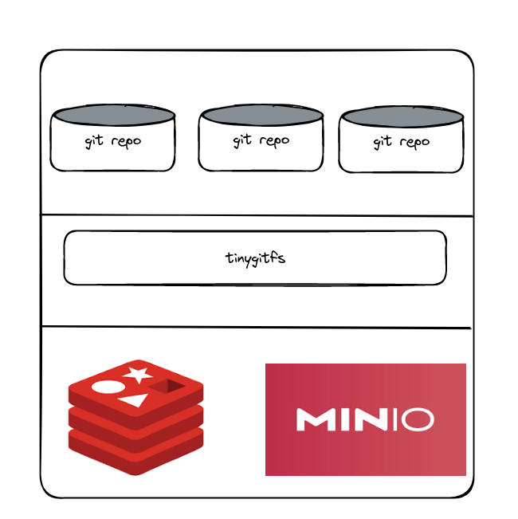

### architecture

#### 涉及组件
GIT FUSE REDIS MINIO

最上面是我们的多个 git 仓库，这些 git 仓库用来与用户或者 git 服务器进行交互。
然后这些 git 仓库并不是直接存储在普通的文件系统之上，而是存储在以 fuse 挂载
的 tinygitfs 之上。所有在 tinygitfs 上进行的文件操作，都会经过内核的 fuse 机制，
来调用我们在 tinygitfs 之上实现的应用逻辑，而这些应用逻辑用来将文件的读写以及其他操作转接
到元数据引擎 redis 和对象存储 minio 上。

tinygitfs 在创建的时候将会初始化 root 节点的内容。之后所有的文件，目录创建，都是基于这个 root 
逐渐扩展出来的。而节点之间的父子，由 fuse 自身或者说 go-fuse 内部进行维护，我们只需要在创建文件，
或者查找文件的时候，创建相应的 inode 通过 fuse 提供的接口接上。

tinygitfs 同时还得维护一个打开文件列表。每个打开的文件都会有拥有一个 pagepool 页表缓存，文件的数据，元数据读写
都是首先和 pagepool 中的缓存页进行交互，然后才是去元数据后端 redis 和数据后端 minio 查询。

minio 主要用来存储 git 仓库中非松散引用，符号引用的文件数据，文件内部以 chunk 分块存储，

redis 主要用来维护文件系统的 inode 结构，目录 dentry 结构，文件数据的 chunk 元数据列表，以及存储 git 仓库的松散引用，符号引用，除此之外还会去维护文件系统的一些属性。

