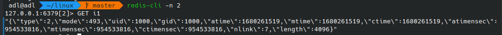

### inode attr

在 tinygitfs 中，由于我们通过 Fuse 将 git 仓库的数据路由到其他的存储介质之上，因此文件的元数据需要我们自己维护。

每个文件往往使用 inode 进行抽象，文件系统上每个文件都有一个 inode number, 用来索引这个文件。

tinygitfs 使用一个 redis 单调递增的 int64 数字来简单表示 文件的 inode number。同时在 redis 中，
我们使用 `K="i{inum}" V={attr}` 来记录一个文件的元数据。

attr 用来记录 inode 的文件的各种属性，如下图所示：

| 字段        | 类型     | 描述            |
|-----------|--------|---------------|
| Typ       | uint8  | 节点类型          |
| Mode      | uint16 | 权限模式          |
| Uid       | uint32 | 拥有者id         |
| Gid       | uint32 | 拥有者组id        |
| Atime     | uint64 | 最后访问时间        |
| Mtime     | uint64 | 最后修改时间        |
| Ctime     | uint64 | 元数据最后修改时间     |
| Atimensec | uint32 | 最后访问时间微秒部分    |
| Mtimensec | uint32 | 最后修改时间微秒部分    |
| Ctimensec | uint32 | 元数据最后修改时间微秒部分 |
| Nlink     | uint32 | 链接数（子目录或硬链接）  |
| Length    | uint64 | 普通文件长度        |
| Rdev      | uint32 | 设备号           |

redis inode attr 例子：
