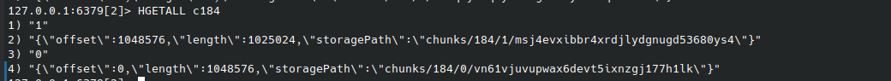

### chunk

tinygitfs 没有直接将文件的全部数据全部保存到一个 minio 的对象中。

而是将文件分割为多个 1MB 的 chunks，每个 chunks 作为一个单独的对象，存储到 minio 中。
其路径名满足 `chunks/{inum}/{chunk number}/{rand number}`。

tinygitfs 在 redis 中通过哈希表来记录这些 chunks 的信息。
其中`Table="c{inum}"`，然后每一项都是： `Key="{chunk number}"` 表示第几块, `Value="{offset, length, storagePath}"` 表示块的偏移量，长度，存储路径。

如图所示 chunks 的元数据结构：

每次读取文件，首先通过偏移量确定是第几块，然后从 redis 查找对应的 chunks 的存储路径，最后再根据存储路径从 minio 上加载文件的数据。