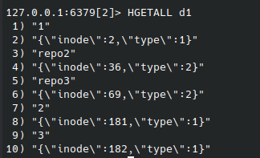

### directory entry

我们在 tinygitfs 中需要自己去维护目录的结构。我们需要能够通过一个路径去查找到对应的文件/目录。
一般来说，我们通过 目录项 directory entry 找到文件的 inode,然后通过文件的 inode 去使用文件。

因此，在 tinygitfs 也实现了 dentry，如下图所示：

| 字段   | 类型     | 描述              |
|------|--------|-----------------|
| Name | string | 路径              |
| Type | uint8  | 类型              |
| Ino  | int64  | 文件 Inode Number |

在元数据引擎 Redis 中，我们通过一个哈希表来存储目录结构，`Table="d{inum}"` 表示一个目录，
然后里面存储多条目录项。每个目录项通过 `Key={path}` 和 `Value={Type} {Ino}` 表示。

当我们在一个目录中需要搜索一个子文件时，我们从这个哈希表中进行查找。

redis 中目录和目录项的结构实例：

