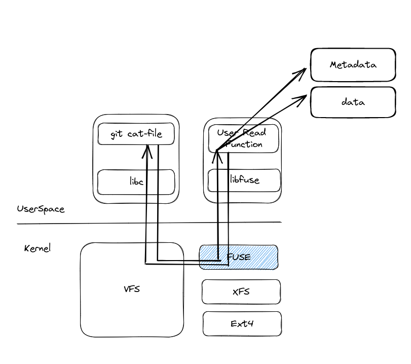

### Fuse

Fuse 是用户态文件系统。tinygitfs 中，我们通过 Fuse 将文件的数据和元数据路由到不同的存储介质上。


简单的说，Fuse hook 了我们的系统调用，例如当我们在 Fuse 挂载的系统上的一个 git 仓库中执行 `git cat-file -p HEAD` 的时候，git 需要读取 `.git/HEAD` 文件，git 会执行 open, read 等系统调用，
正常来说 kernel 中的 VFS 会将我们这些请求转给文件真实所在的文件系统，例如常见的 ext4，调用文件系统相应的文件 ext4_open, ext4_read 函数。但是由于我们这里挂载了 fuse 文件系统，我们的文件请求会被被转给了内核中的 Fuse 设备。
Fuse 设备再会将这个请求转交给用户态实现的接口，也就是我们在 tinygitfs 中实现的：
```
func (fh *RegularFileHandler) Read(ctx context.Context, dest []byte, off int64) (fuse.ReadResult, syscall.Errno) {
...
}
```

用户态的接口来实现将文件的读取请求，也就是从其他的存储介质例如 minio 上进行读取。然后 Fuse 再会将请求结果传回 VFS, VFS 将请求的结果拷贝回用户态。


总之，只要我们将 fuse 的上层接口进行实现，我们的文件数据就可以绕过正常文件系统的写入逻辑，而是写到你期望的外部存储上。


本项目使用了 [hanwen/go-fuse](https://github.com/hanwen/go-fuse) 来和 Fuse 进行交互。

tinygitfs 中为文件节点实现了这些接口，以实现文件的增删改查，硬链接，查找，重命名，读写属性，目录的遍历，文件系统的数据查找。
```
var _ = (fs.NodeAccesser)((*Node)(nil))
var _ = (fs.NodeGetattrer)((*Node)(nil))
var _ = (fs.NodeMknoder)((*Node)(nil))
var _ = (fs.NodeMkdirer)((*Node)(nil))
var _ = (fs.NodeReaddirer)((*Node)(nil))
var _ = (fs.NodeOpendirer)((*Node)(nil))
var _ = (fs.NodeLookuper)((*Node)(nil))
var _ = (fs.NodeRmdirer)((*Node)(nil))
var _ = (fs.NodeUnlinker)((*Node)(nil))
var _ = (fs.NodeSetattrer)((*Node)(nil))
var _ = (fs.NodeRenamer)((*Node)(nil))
var _ = (fs.NodeLinker)((*Node)(nil))
var _ = (fs.NodeOpener)((*Node)(nil))
var _ = (fs.NodeStatfser)((*Node)(nil))

var _ = (fs.FileHandle)((*RegularFileHandler)(nil))
var _ = (fs.FileWriter)((*RegularFileHandler)(nil))
var _ = (fs.FileReader)((*RegularFileHandler)(nil))
var _ = (fs.FileFlusher)((*RegularFileHandler)(nil))
var _ = (fs.FileFsyncer)((*RegularFileHandler)(nil))
var _ = (fs.FileReleaser)((*RegularFileHandler)(nil))
var _ = (fs.FileGetattrer)((*RegularFileHandler)(nil))
var _ = (fs.FileSetattrer)((*RegularFileHandler)(nil))
```